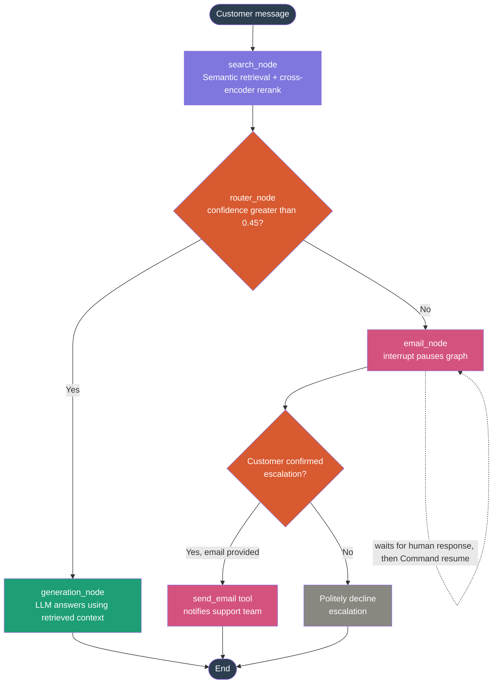
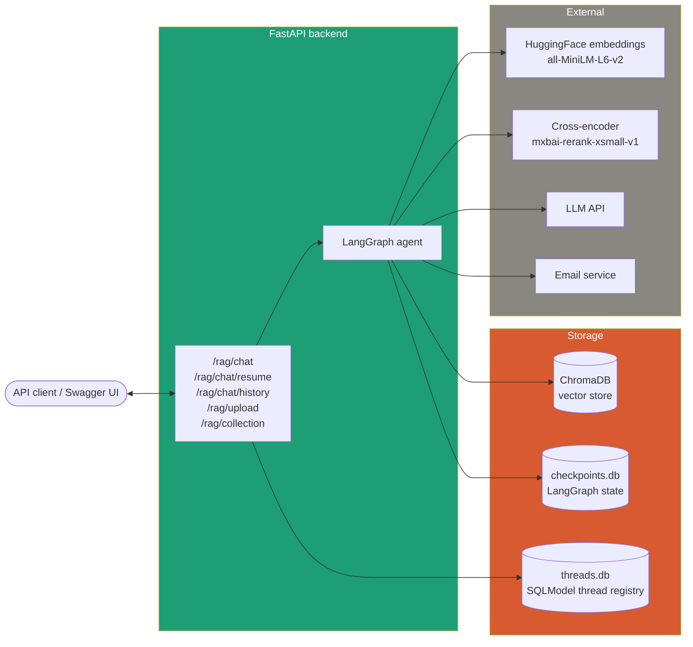

# 🤖 RAG Customer Support Agent

A production-style customer support agent built with **LangGraph**, combining retrieval-augmented generation, confidence-based routing, and human-in-the-loop escalation — served through a **FastAPI** backend and a **Streamlit** chat interface.


---

## 📌 Overview

Most "RAG chatbot" projects stop at retrieve → generate. This one goes further: the agent **knows when it doesn't know**. Every answer is scored for confidence based on how well the retrieved context actually supports it. When confidence is low, the agent doesn't guess — it pauses execution mid-conversation, asks the customer for permission to escalate, collects their email, and hands the query off to a human support team via email, all without losing conversational context.

The "pause and wait for a human" part is the core engineering challenge this project solves, using LangGraph's `interrupt()` mechanism backed by SQLite checkpointing — the graph's execution state is durably persisted mid-flight, survives across separate HTTP requests, and resumes exactly where it left off once the customer responds.

---

## ✨ Key Features

| Feature | What it demonstrates |
|---|---|
| 🔍 **Semantic retrieval over a custom knowledge base** | Documents are chunked, embedded, and stored in ChromaDB for similarity search |
| 🎯 **Cross-encoder reranking** | Top-k retrieved chunks are rescored with a cross-encoder (`mxbai-rerank-xsmall-v1`) for higher-precision relevance ranking before being passed to the LLM |
| 📊 **Confidence-based routing** | The reranker's top relevance score drives a conditional edge in the graph — confident answers are generated directly, low-confidence ones are escalated |
| 🧑‍💻 **Human-in-the-loop (HITL) escalation** | Using LangGraph's `interrupt()` + `Command(resume=...)`, the graph pauses execution, asks the customer to confirm escalation and provide an email, then resumes exactly where it stopped |
| 💾 **Multi-turn conversation memory** | LangGraph's `AsyncSqliteSaver` checkpointer persists full conversation state per session (`thread_id`), so follow-up questions retain context |
| 📧 **Automated email escalation** | Confirmed escalations are sent directly to the support team via an email tool node in the graph |
| 🗂️ **Thread tracking with SQLModel** | Every conversation thread is registered in its own SQLite-backed table (`threads.db`) with status tracking (active / escalated / resolved) |
| 🧹 **Knowledge base management** | Upload new documents to reindex the vector store, or wipe the entire Chroma collection via a dedicated endpoint |

---

## 🧠 LangGraph Workflow



### Node-by-node

| Node | Type | Responsibility |
|---|---|---|
| `search_node` | Retrieval | Embeds the query, runs semantic similarity search against ChromaDB (top 10), reranks candidates with a cross-encoder, keeps the top 4 chunks as context, and records the top rerank score as `confidence` |
| `router_node` | Conditional edge | Pure routing function — no LLM call. Reads `confidence` from state and sends the flow to `generation_node` or `email_node` |
| `generation_node` | Generation | Calls the LLM with the retrieved context and the user's query, constrained to answer only from the given context |
| `email_node` | Human-in-the-loop | Calls `interrupt()` to pause the graph and ask the customer to confirm escalation + provide an email. On resume, either sends the escalation email via the `send_email` tool or gracefully declines |

### Why the HITL step is a genuine engineering problem (not just an `if` statement)

A normal function can't pause mid-execution and wait for a human to respond through a web UI — that could take seconds or hours, and the original HTTP request that triggered it is long closed. LangGraph solves this by:

1. `interrupt(payload)` raises a control-flow signal that stops the node exactly there and serializes the entire graph state to SQLite via the checkpointer.
2. The API call returns immediately with the interrupt payload — the frontend renders a confirmation prompt.
3. A **separate** API call, `POST /rag/chat/resume`, later sends `Command(resume={...})` with the same `thread_id`. LangGraph loads the saved checkpoint and resumes execution inside `email_node` at the exact line it paused on — with `interrupt()` now returning the human's answer instead of pausing again.

This is why the backend exposes two distinct chat endpoints (`/chat` and `/chat/resume`) rather than one — they correspond to two fundamentally different moments in the graph's lifecycle: starting/continuing a turn, versus answering a pending interrupt.

---

## 🏗️ Architecture



> Note: there is currently no dedicated frontend — the API is tested directly via FastAPI's auto-generated Swagger docs at `/docs`, or any HTTP client (curl, Postman, etc).

---

## 🗂️ Project Structure

```
RAG-Customer-Support-Agent/
├── backend/
│   ├── main.py                  # FastAPI app entrypoint, lifespan-managed checkpointer
│   ├── core/
│   │   └── settings.py          # env config (API keys, paths)
│   ├── services/
│   │   ├── graph.py             # LangGraph StateGraph definition (uncompiled)
│   │   ├── loader.py            # document loading for upload endpoint
│   │   └── email_tool.py        # send_email tool used by email_node
│   ├── routers/
│   │   └── rag.py               # /rag/* API routes
│   ├── schemas/
│   │   └── fastapi_models.py    # Pydantic request/response models
│   └── data/
│       ├── chroma/               # persisted Chroma vector store
│       ├── checkpoints.db        # LangGraph conversation state (auto-managed)
│       └── threads.db            # SQLModel thread registry (this project's own table)
├── requirements.txt
└── .env
```

---

## ⚙️ Tech Stack

| Layer | Tool | Why |
|---|---|---|
| Agent orchestration | **LangGraph** | Stateful graph execution, conditional routing, built-in HITL via `interrupt()`, checkpointed persistence |
| Retrieval | **ChromaDB** + **HuggingFace embeddings** (`all-MiniLM-L6-v2`) | Local, free, fast semantic similarity search |
| Reranking | **Cross-encoder** (`mixedbread-ai/mxbai-rerank-xsmall-v1`) via `sentence-transformers` | Higher-precision relevance scoring than embedding similarity alone — also doubles as the confidence signal |
| Generation | **LLM API call** | Answers strictly grounded in retrieved context |
| Backend | **FastAPI** | Async-native, plays well with LangGraph's async nodes and SSE-style flows |
| Conversation persistence | **LangGraph `AsyncSqliteSaver`** | Per-session (`thread_id`) checkpointing — multi-turn memory and HITL pause/resume, no custom state management code |
| Thread tracking | **SQLModel** | Lightweight ORM for the app's own `threads.db` table, separate from LangGraph's internal checkpoint schema |

---

## 🔌 API Endpoints

| Method | Endpoint | Purpose |
|---|---|---|
| `POST` | `/rag/upload` | Upload and index documents into the Chroma vector store |
| `POST` | `/rag/chat` | Send a message — starts a new thread or continues an existing one |
| `POST` | `/rag/chat/resume` | Resume a paused conversation after a human answers a pending HITL confirmation |
| `GET` | `/rag/chat/{thread_id}/history` | Retrieve the full message history for a conversation thread |
| `DELETE` | `/rag/collection` | Wipe the entire Chroma vector store |
| `GET` | `/health` | Basic liveness check |

---

## 🚀 Running Locally

> This project is not currently deployed — it runs fully locally.

### 1. Clone and set up the environment

```bash
git clone <your-repo-url>
cd RAG-Customer-Support-Agent
python -m venv rag-env
rag-env\Scripts\activate        # Windows
# source rag-env/bin/activate   # macOS/Linux
```

### 2. Install dependencies

```bash
pip install langgraph langgraph-checkpoint-sqlite langchain langchain-community langchain-huggingface chromadb rank_bm25 sentence-transformers anthropic fastapi "uvicorn[standard]" sse-starlette sqlmodel python-dotenv pydantic langchain-chroma
```

### 3. Configure environment variables

Create a `.env` file in the project root:

```env
HF_TOKEN=your_huggingface_token
ANTHROPIC_API_KEY=your_llm_api_key
CHROMA_PERSIST_DIRECTORY=backend/data/chroma
DATA_DIR=backend/data
# + any email service credentials your email_tool.py requires
```

### 4. Run the backend

Run from the **project root**, not from inside `backend/` — `backend` needs to resolve as an importable package:

```bash
uvicorn backend.main:app --reload
```

Confirm it started correctly:

```bash
curl http://localhost:8000/health
# {"status": "ok"}
```

### 5. Try it out

FastAPI auto-generates interactive docs — open **`http://localhost:8000/docs`** in your browser and call the endpoints directly from there, or use curl/Postman:

1. `POST /rag/upload` — upload a knowledge base document.
2. `POST /rag/chat` — ask a question the document covers → get a grounded answer with a `thread_id` in the response.
3. `POST /rag/chat` — ask something clearly out of scope, reusing the same `thread_id` → the response comes back with `status: "needs_confirmation"` and an escalation prompt.
4. `POST /rag/chat/resume` — reply with `{"thread_id": "...", "confirmed": true, "email": "you@example.com"}` to confirm escalation, or `confirmed: false` to decline.

---

## 🧩 Design Decisions Worth Noting

- **Confidence comes from the reranker, not a separate LLM call.** The cross-encoder's top relevance score is reused directly as the routing signal — no extra latency or cost spent asking the LLM "how confident are you?" separately.
- **Two SQLite databases, two owners.** `checkpoints.db` is fully managed by LangGraph's checkpointer and never touched directly. `threads.db` is this project's own SQLModel table for tracking thread status/escalation metadata — kept deliberately separate so the app's own schema never risks colliding with LangGraph's internal one.
- **The graph is compiled once, at startup, inside FastAPI's lifespan** — not at import time — because `AsyncSqliteSaver` must be entered as an async context manager, which isn't possible at plain module load.

---

## 🛣️ Possible Next Steps

- Build a chat frontend (Streamlit or a small React UI) so the HITL confirmation flow can be tested visually instead of via `/docs`
- Add BM25 keyword search alongside semantic retrieval for a true hybrid pipeline (helps with exact terms like SKUs/error codes that embeddings can miss)
- Streaming token-by-token responses via SSE
- Admin dashboard for reviewing escalated threads
- Deploy backend + frontend with persistent storage for the vector store and SQLite files
